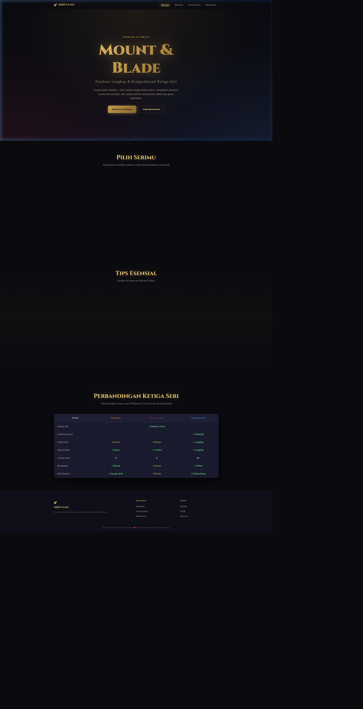

# ⚔️ Mount & Blade: Ultimate Guide

Selamat datang di repositori **Mount & Blade: Ultimate Guide**! 
Website ini adalah panduan komprehensif berbahasa Indonesia untuk tiga seri legendaris dari *franchise* Mount & Blade:
- **Mount & Blade: Warband**
- **Mount & Blade: With Fire & Sword**
- **Mount & Blade II: Bannerlord**



## 🌐 Live Demo
Website ini sudah di-hosting dan dapat diakses secara publik melalui tautan berikut:
👉 **[Kunjungi M&B Guide (Vercel)](https://m-and-bweb-r9el5xzt3-argeswara-pradana-karamullah-s-projects.vercel.app)**

## ✨ Fitur Utama
- **Desain Premium & Gelap (*Dark Mode*)**: Estetika antarmuka yang elegan, modern, dan sangat nyaman di mata, terinspirasi dari UI/UX game modern.
- **Navigasi Interaktif**: Sidebar interaktif yang mulus untuk melompat antar bagian panduan dengan mudah.
- **Responsif 100%**: Tampilan yang sempurna dan optimal baik saat dibuka melalui Desktop, Tablet, maupun Smartphone.
- **Panduan Super Lengkap**: Mulai dari mekanis *combat*, pengelolaan pasukan, faksi, *smithing*, hingga *easter eggs* dan tips menguasai Calradia.

## 🛠️ Teknologi yang Digunakan
Website ini dibangun dari nol dengan menggunakan *Tech Stack* modern namun ringan:
- **HTML5** (Semantik dan SEO Friendly)
- **Vanilla CSS3** (Custom Properties, Flexbox, CSS Grid, Animasi, Glassmorphism)
- **Vanilla JavaScript (ES6)** (Interaksi DOM, Smooth Scrolling, Particles UI)
- **Phosphor Icons** (Sistem ikon resolusi tinggi)
- **Google Fonts** (Kombinasi *Cinzel*, *Crimson Text*, dan *Inter*)

## 🚀 Cara Menjalankan Secara Lokal (Local Development)
Jika Anda ingin mengembangkan atau menjalankan website ini di komputer Anda sendiri:

1. **Clone repositori ini**:
   ```bash
   git clone https://github.com/Argeswara-ops/m-b-guide-web.git
   ```
2. Buka folder proyek tersebut di *Code Editor* Anda (misalnya VS Code).
3. Anda bisa menggunakan ekstensi **Live Server** di VS Code, atau jika menggunakan Python, jalankan perintah berikut di terminal:
   ```bash
   python -m http.server 5500
   ```
4. Buka browser dan navigasikan ke `http://localhost:5500`.

## 📜 Lisensi
Dikembangkan untuk komunitas Mount & Blade Indonesia. Seluruh hak cipta nama, logo, dan aset game Mount & Blade adalah milik **TaleWorlds Entertainment**.

---
*Dibuat dengan ❤️ untuk para Warlords Calradia.*
